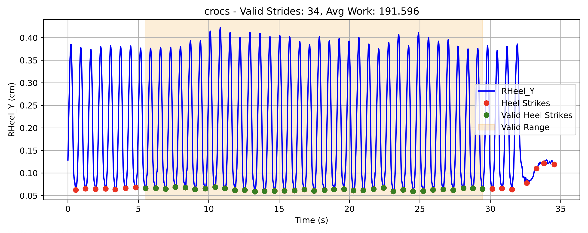
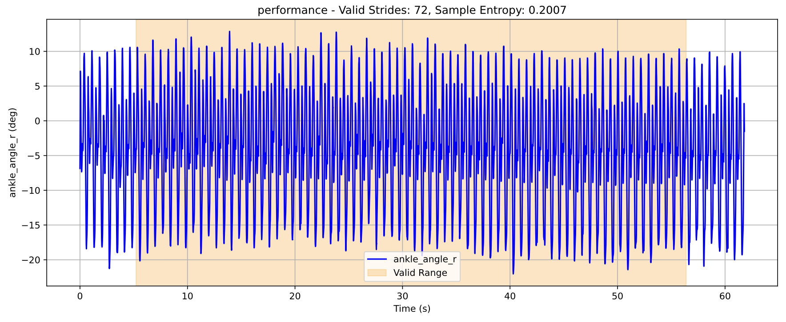

# k2_running

## ⚡️ 에너지 효율성 점수
### 1) 산출 방식
    - 하체 관절 위주로 mechanical work 합산
    - 상대적인 비교를 위해 average mechanical work per stride로 정규화

    - Heel strike 기준으로 stride 자동 분류 
        - RHeel_Y를 기준으로 local minimum
        - 30 frame 정도
    
    - Valid Stride 기준
        - 시작 5초 이후 stride
        - 종료 5초 이전 stride
    
    - 사용되는 하체 관절 (오른쪽만)
        - hip_flexion_r
        - knee_angle_r
        - ankle_angle_r

### 2) 산출 결과
    - output 디렉토리에 energy_efficiency PDF로 저장
        - crocs: 신발 이름
        - Valid Strides: Strides count
        - Avg Work: Average Mechanical Work per stride
        

## 🏃🏻‍♂️️ 러닝 일관성 점수
### 1) 산출 방식

    - Heel strike 기준으로 stride 자동 분류 
        - RHeel_Y를 기준으로 local minimum
        - 30 frame 정도
    
    - Valid Stride 기준
        - 시작 5초 이후 stride
        - 종료 5초 이전 stride

    - 사용되는 하체 관절
        - ankle_angle_r

### 2) 산출 결과
    - output 디렉토리에 consistency PDF로 저장
        - performance: 신발 이름
        - Valid Strides: Strides count
        - Sample Entropy: 러닝 일관성 점수

